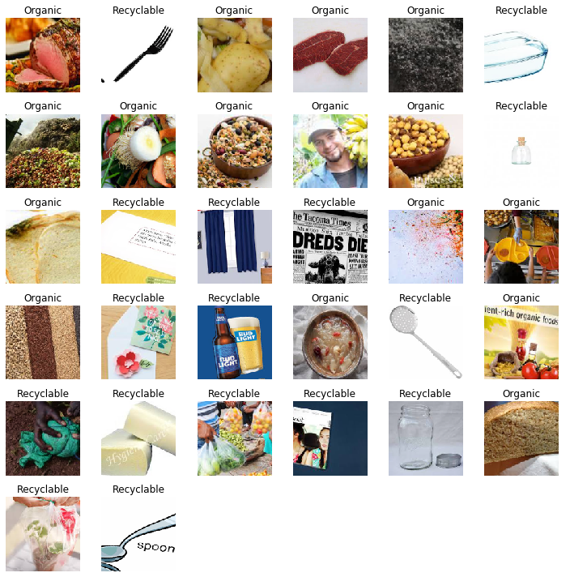
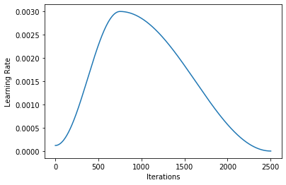
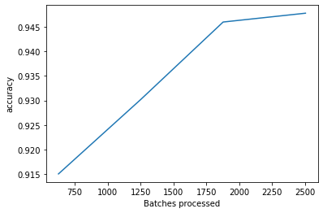
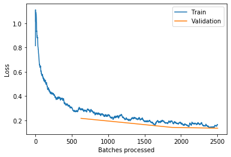
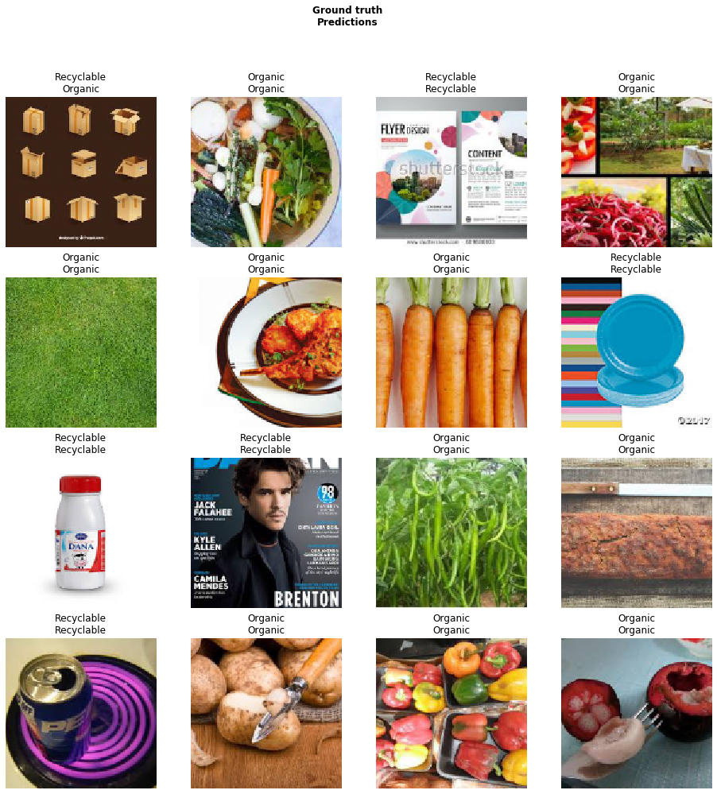

# Waste Classification

With the current world environment scenario in mind, I always wanted to use the existing technology to make a difference in how we perceive and classify the waste/garbage that we dispose in our daily lives. We know that a lot of things that are non-biodegradable are disposed carelessly, which have severe repercussions on our environment. The idea was to come up with a Waste Classifier that allows us to correctly identify the type of waste, ie. Whether it is recyclable, or organic, based on which it can be disposed properly.  Although it might not be of great significance, it was fascinating to come up with an innovative idea that can be expanded and implemented in various places. 

Moreover, I added a text-to-speech feature that allows people who are visually impaired to use it without any problems

## Implementation

**Click on the image below to play the video**

## Model and Data

### Samples:

### Learning Rate:

### Metrics:

### Losses:

### Results:

## License
[GNU AGPL v3.0](https://choosealicense.com/licenses/agpl-3.0/)